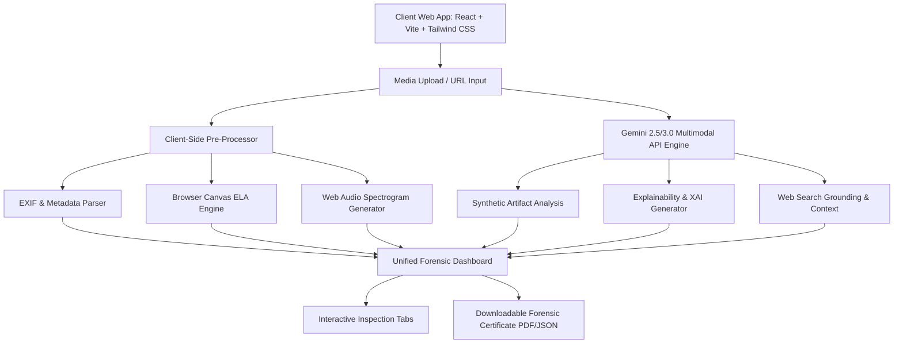

# Product Requirements Document (PRD)
## Deep-Media-Analyzer (VeritasAI Platform)

### 1. Executive Summary & Product Vision
In an era dominated by rapid advancements in generative AI, deepfakes, synthetic audio clones, and manipulated video, information integrity has become a critical challenge. **Deep-Media-Analyzer (VeritasAI)** is a modern, GenAI-powered web platform engineered to help journalists, researchers, OSINT analysts, fact-checkers, and everyday citizens detect, understand, and verify synthetic or altered media before trusting or sharing it.

The platform combines multi-modal AI reasoning (via Google Gemini 2.5/3.0), client-side digital image forensi-cs (Error Level Analysis, EXIF metadata inspection, audio waveform/spectrogram rendering), and web-grounded source-tracing into an intuitive, accessible forensic dashboard.

---

### 2. Target Audience & User Personas

| Persona | Primary Needs | Key Platform Features Utilized |
| :--- | :--- | :--- |
| **Investigative Journalist & Fact-Checker** | Needs verifiable proof, cryptographic hashes, source context, and exportable forensic certificates for publishing. | Deep EXIF/C2PA audit, source-tracing web search, PDF/JSON forensic report export. |
| **OSINT & Security Researcher** | Requires granular frame-by-frame analysis, audio spectral consistency checks, and ELA visual manipulation heatmaps. | Interactive Heatmap, Audio Spectrogram, EXIF inconsistency matrix, frame scrubber. |
| **Everyday Citizen** | Needs quick, understandable risk scores and natural language explanations without technical jargon. | Executive Summary score gauge, "Why this score?" natural language breakdown, safety recommendations. |

---

### 3. Core Capabilities & Product Features

#### 3.1 Multi-Format Media Ingestion & Demo Suite
- **Upload Formats**:
  - **Images**: PNG, JPG, WEBP, AVIF, GIF
  - **Audio**: MP3, WAV, M4A, OGG, FLAC
  - **Video**: MP4, WEBM, MOV
- **URL & Social Link Ingestion**: Input direct URL or media links from news/social feeds.
- **Benchmark Showcase (Pre-loaded Samples)**:
  - Deepfake celebrity / political speech video & audio.
  - Midjourney / Stable Diffusion generative hyper-realistic portrait.
  - Authentic field journalism photo with raw EXIF metadata.
  - Manipulated image with spliced background & ELA anomalies.

#### 3.2 Multi-Layer Detection & Forensic Engine
1. **AI Visual & Generation Artifact Detector**:
   - Analyzes facial symmetry, iris reflections, background warping, frequency domain noise, skin texture smoothness, lighting/shadow vector alignment, and hair boundary blurring.
2. **Audio Forensic Engine**:
   - Detects vocoder robotic artifacts, phase discontinuities, unnatural spectral energy falloff, robotic pitch consistency, and synthetic silence/breath patterns.
3. **Video Frame & Temporal Scrubber**:
   - Evaluates frame-by-frame consistency, lip-sync mismatch score, temporal flickering, and facial mesh stability over time.
4. **Digital Metadata & Provenance Audit**:
   - Extracts EXIF data (camera make/model, ISO, aperture, software signatures, creation date).
   - Identifies synthetic watermarks (C2PA headers, SynthID markers, AI generation tool tags like "Adobe Firefly", "DALL-E", "ComfyUI").
5. **Client-Side Error Level Analysis (ELA)**:
   - Computes compression differential maps directly in the browser canvas to pinpoint resaved, modified, or pasted image segments.

#### 3.3 Explainable AI (XAI) & Interactive Visualizations
- **Trust & Synthetic Risk Gauge**:
  - **0-30%**: Likely Authentic (High Confidence)
  - **31-65%**: Suspicious / Inconclusive (Requires Manual Review)
  - **66-100%**: Highly Synthetic / Manipulated (High Confidence AI)
- **Natural Language Reasoning Breakdown**:
  - Bulleted explainability breakdown categorized by *Key Findings*, *Visual Anomalies*, *Audio Anomalies*, and *Metadata Indicators*.
- **Interactive Visual Heatmap & Bounding Boxes**:
  - Overlay highlighting suspicious image regions (e.g. AI-generated hands, mismatched background textures, face boundary artifacts).
- **Interactive Audio Spectrogram & Waveform Scrubber**:
  - Visual frequency heatmap highlighting unnatural synthetic frequency bands.

#### 3.4 Source-Traceable Context & Web Verification
- **Reverse Search Query Synthesizer**: Generates optimized reverse search parameters based on image keyframes and detected entities.
- **Contextual Grounding**: Powered by Gemini Search Grounding to find original publisher source, news reporting history, and existing fact-check debunk articles.
- **Timeline & Provenance Map**: Shows earliest recorded online appearance vs current viral context.

#### 3.5 Forensic Certificate & Verification Report
- **Export Formats**: PDF Verification Report & Cryptographic JSON Evidence Package.
- **Verification Metadata**: SHA-256 media fingerprint, analysis timestamp, model confidence scores, complete prompt log, and forensic breakdown summary.

---

### 4. Technical Architecture & Tech Stack

- **Frontend**: Next.js (App Router), React 19, TypeScript, Tailwind CSS, Lucide Icons.
- **UI Components**: Shadcn UI inspired component primitives (Cards, Badges, Tabs, Dialogs, Progress Bars, Tooltips).
- **AI Engine & API Routes**: Next.js Server Actions / API Routes + Google Gemini API (`@google/genai` package) with structured JSON schemas and web search grounding.
- **Forensic Utilities**: `exifr` for EXIF metadata parsing, HTML5 Canvas API for ELA, Web Audio API (`AudioContext`, `AnalyserNode`) for live spectrogram generation.
- **PDF Generation**: `jspdf` / `html2canvas` for one-click forensic audit certificate export.

---

### 5. Non-Functional Requirements & Performance
- **Response Time**: Initial client-side ELA & EXIF analysis within < 300ms; complete GenAI multimodal forensic reasoning within 2-4 seconds.
- **Privacy & Security**: All client processing done in-browser when possible. API keys securely handled via environment configuration. No media retained without user consent.
- **Accessibility & Responsiveness**: WCAG 2.1 AA compliant, responsive desktop and mobile views with high contrast dark mode UI.
